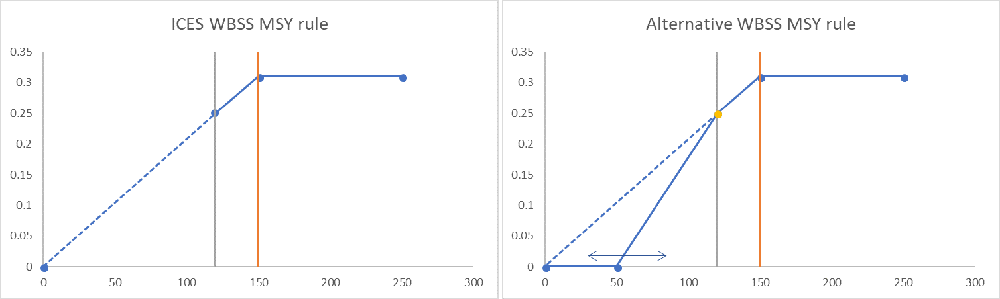

```{r setup, include=FALSE}

# =======================================================================================
# WBSS MSE.Rmd
# 
# 09/07/2018 adapted version eqsim3 with HCR that has steeper slope below Blim. 
# 15/07/2018 Code is adapted to run for WBSS herring
#              - changed average recruitment is calculated (only for years used in SR estimation)
#              - changed calculation of starting population (old code had error in plus group)
#              - added year to the arrays (instead of numbering from 1 onwards)
# 13/08/2018 Converted r code to markdown
# OMZETTEN NAAR FLSTOCK & FLASHER
# =======================================================================================

require("knitr")
knitr::opts_chunk$set(echo = FALSE,	message = FALSE,	warning = FALSE,	comment = "",	crop = TRUE )
knitr::opts_chunk$set(fig.width=10) 

# packages 
rm(list=ls())

library(ggplot2)
library(FLCore)
library(msy)
library(tidyverse)
library(minpack.lm)    # install.packages("minpack.lm")
library(captioner)     # captioning of figures and tables

source("theme_publication.r")

# Functions -------------------------------------------------------

# Function for segmented regression through Blim
SegregBlim  <- function(ab, ssb) log(ifelse(ssb >= blim, 
                                            ab$a * blim, 
                                            ab$a * ssb))

# Function to calculate the harvest by fleet given a TAC for a stock ; NOT WORKING YET
fleet.harvest <- function(stk,iYr,TACS){
  nUnits  <- dims(stk)$unit
  
  #- prepare for iterations
  nIter   <- dims(TACS)$iter
  res     <- matrix(NA,ncol=nIter,nrow=nUnits,
                    dimnames=list(units=dimnames(stk@stock.n)$unit,iter=1:nIter))
  for(iTer in 1:nIter) 
    res[,iTer] <- nls.lm(par=runif(nUnits),
                         lower=rep(1e-8,nUnits), 
                         upper=NULL,
                         rescaleF,
                         stk=iter(stk,iTer),
                         iYr=iYr,
                         TACS=c(iter(TACS,iTer)),
                         nls.lm.control(ftol = (.Machine$double.eps),maxiter = 1000),jac=NULL)$par
  stk@harvest[,iYr] <- sweep(stk@harvest[,iYr],c(3,6),res,"*")
  return(stk@harvest[,iYr])
}

# Function to scale the F pattern for stock NOT USED BECAUSE NOT WORKING
rescaleF      <- function(mult,stk.=stk,iYr.=iYr,TACS.=TACS){
  stk.@harvest[,iYr.] <- sweep(stk.@harvest[,iYr.],3,mult,"*")
  stkZ                <- unitSums(stk.@harvest[,iYr.]) + stk.@m[,iYr.,1]
  ctch                <- c(apply(sweep(stk.@stock.n[,iYr.] * stk.@catch.wt[,iYr.] * sweep(stk.@harvest[,iYr.],c(1:2,4:6),stkZ,"/"),c(1:2,4:6),(1-exp(-stkZ)),"*"),3:6,sum,na.rm=T))
  
  res                 <- sqrt(c((TACS. - c(apply(sweep(stk.@stock.n[,iYr.] * stk.@catch.wt[,iYr.] * sweep(stk.@harvest[,iYr.],c(1:2,4:6),stkZ,"/"),c(1:2,4:6),(1-exp(-stkZ)),"*"),3:6,sum,na.rm=T)))^2))
  return(res)}

# Settings
fig_nums <- captioner::captioner(prefix = "Figure")
tab_nums <- captioner::captioner(prefix = "Table")

# -------------------------------------------------------------------------------------------
# load the WBSS assessment object(s)
# -------------------------------------------------------------------------------------------

load("D:/HAWG/2018/05. Data/WBSS/WBSS_mf_004/Herring WBSS_2016_EqSim_Workspace.Rdata")
# plot(stk)

```

**Evaluation of alternative harvest control rules for Western Baltic Herring**

**Martin Pastoors^1^**

`r format(Sys.time(), '%d/%m/%Y %H:%M')`


&nbsp;  

**Abstract**

The ICES advice for Western Baltic Spring Spawning herring (WBSS) in 2019 is for a zero TAC. The rationale behind this advice is "There are no catch scenarios that will rebuild the stock above Blim by 2020. ICES advises zero catch under such circumstances". This means that the standard interpretation of the ICES advice rule is that a zero advice will be issued if the stock cannot be rebuilt above Blim within a period of one year. However, this interpretation has not been informed by an analysis of consequences of allowing for longer periods of rebuilding to above Blim. 

In this document, a variant of the standard ICES advice rule has been evaluated using a slightly modified version of the EQSIM software. The HCR variant is that below Blim, fishing mortality will be strongly reduced. This is achieved by introducing a third biomass reference point (Blim2) which is the biomass at which fishing mortality will be set to zero. The evaluations are based on the agreed reference points for WBSS herring (i.e. Fmsy, Blim, MSY Btrigger) and evaluated the consequences of different choices for Blim2. The most extreme cases are Blim2 = Blim, which means that F is set to zero when the stock is below Blim and Blim2 = 0 which means a linear reduction of F from F at Blim down to the origin. 

[ Results here ]


^1^ mpastoors@pelagicfish.eu

##### Page break

<!--1. Introduction ------------------------------------------------------ -->

# Introduction

The ICES advice for Western Baltic Spring Spawning herring (WBSS) in 2019 is for a zero TAC. The rationale behind this advice is "There are no catch scenarios that will rebuild the stock above Blim by 2020. ICES advises zero catch under such circumstances". This means that the standard interpretation of the ICES advice rule is that a zero advice will be issued if the stock cannot be rebuilt above Blim within a period of one year. However, this interpretation has not been informed by an analysis of consequences of allowing for longer periods of rebuilding to above Blim. 

In this document, a variant of the standard ICES advice rule has been evaluated using a slightly modified version of the EQSIM software. The HCR variant is that below Blim, fishing mortality will be strongly reduced. This is achieved by introducing a third biomass reference point (Blim2) which is the biomass at which fishing mortality will be set to zero. The evaluations are based on the agreed reference points for WBSS herring (i.e. Fmsy, Blim, MSY Btrigger) and evaluated the consequences of different choices for Blim2. The most extreme cases are Blim2 = Blim, which means that F is set to zero when the stock is below Blim and Blim2 = 0 which means a linear reduction of F from F at Blim down to the origin `r fig_nums("hcrs", display="cite")`. 

```{r, fig.align="center", fig.asp=0.4, message=FALSE, warning=FALSE}

fig_nums(name    = "hcrs", display = FALSE, 
         caption = "ICES WBSS MSY rule (left) and Alternative WBSS MSY rules (right)" )


```

*`r fig_nums("hcrs")`*

<!--2. Material and methods ------------------------------------------------------ -->

# Material and methods

The EQSIM code available at https://github.com/ices-tools-prod/msy/blob/master/R/eqsim_run.R was primarily modified for the section where the harvest control rule is being coded, although smaller changes were also introduced for the scanning and the handling of results. The alternative HCR was coded as follows: 

```{r, fig.align="center", fig.asp=0.4, message=FALSE, warning=FALSE}

include_graphics("HCR code.png")
```


<!--3. Results ------------------------------------------------------ -->

# Results

The WBSS EQSIM run at HAWG 2018 was carried out with a combined stock recruitment curve which was largely dominated by the segmented regression: 

```{r echo=TRUE, fig.align="center", fig.asp=0.7, message=FALSE, warning=FALSE}

fig_nums(name    = "srr1", display = FALSE, 
         caption = "ICES WBSS SRR curve as estimated by HAWG 2018" )

#### recruitment with multi-model estimation
noSims    <- 999
appModels <- c("Segreg","Ricker","Bevholt") 
rmSRRYrs  <- c()  
FIT_All   <- eqsr_fit(stk,nsamp=noSims, models = appModels, remove.years=rmSRRYrs)
eqsr_plot(FIT_All,n=2e4)


```

*`r fig_nums("srr1")`*

&nbsp;  

Here we used a more pessimistic recruitment curve based on the most recent recruitments (that is also the basis of Blim) and a segmented regression that is forced through Blim.

```{r echo=TRUE, fig.align="center", fig.asp=0.7, message=FALSE, warning=FALSE}

fig_nums(name    = "srr2", display = FALSE, 
         caption = "ICES WBSS SRR curve using SegregBlim and short time series" )

noSims          <- 999
blim            <- 120000
rmSRRYrs        <- c(1991:1999)   # years to remove for SRR estimation
stk.sr          <- trim(stk, year=(max(rmSRRYrs)+1):dims(stk)$maxyear)
FIT_segregBlim  <- eqsr_fit(stk.sr,nsamp=noSims, models = "SegregBlim")
eqsr_plot(FIT_segregBlim,n=2e4)

```

*`r fig_nums("srr2")`*

In the plots below the facets refer to Blim2 (i.e. Blim2=0 is the ICES MSY rule extended down to the origin, Blim2=120000 is the de facto ICES rule with an F=0 if stock is below Blim). Plots below are mostly worm plots (20 iterations). They all indicate that recovey to MSY Btrigger will take until around 2020, also with the zero catch option (Blim2 = 120000t). 

```{r echo=TRUE}

# Simulations; no output yet

fit       = FIT_segregBlim
bio.years = c(2012, 2016)
bio.const = FALSE
sel.years = c(2012, 2016)
sel.const = FALSE
Fmsy      = 0.31
Fcv       = 0.212
Fphi      = 0.423
SSBcv     = 0.0
SSBphi    = 0.0
# Fcv       = 0.23
# Fphi      = 0.24
# SSBcv     = 0.31
rhologRec = FALSE
Blim      = 120000
Bpa       = 150000
Btrigger  = 150000
Blim2     = 60000
Blim2.scan= seq(0, Blim, by = 20000)
Nyear     = 15
Nits      = 500
process.error = FALSE
verbose = TRUE
recruitment.trim = c(3, -3)
CatchInFirstYear = 50740
rmSRRYrs        <- c(1991:1999)   # years to remove for SRR estimation

# initial checks
if (abs(Fphi) >= 1)
  stop("Fphi, the autocorelation parameter for log F should be between (-1, 1)")
if ((recruitment.trim[1] + recruitment.trim[2]) > 0)
  stop("recruitment truncation must be between a high - low range")

# set year ranges
btyr1 <- bio.years[1]
btyr2 <- bio.years[2]
slyr1 <- sel.years[1]
slyr2 <- sel.years[2]

# Number of years to keep (= all)
keep <- Nyear

# Define simulation start and end year
simstartyear <- max(sel.years)+1
simendyear   <- simstartyear + Nyear - 1


# Resample SR parameters for each of the iterations
SR         <- fit$sr.sto[sample(1:dim(fit$sr.sto)[1] , Nits , replace = F),]

# historical data on stock and recruitment (only for the years used to estimate the SR curve)
data       <- 
  fit$rby[, c("rec", "ssb", "year")] %>% 
  filter (year > max(rmSRRYrs))  # make sure to only use the years that were used to estimate SR

# stock object and subsets for bioyears and selectionyears
stk        <- fit$stk
stk.win    <- FLCore::window(stk, start = btyr1, end = btyr2)
stk.winsel <- FLCore::window(stk, start = slyr1, end = slyr2)

# Function to replace zero by NA
ReplaceZeroByNA <- function(x, i) {
  x2    <- x
  x2[i] <- NA                                # replace x2 with NA for i = TRUE
  x2[]  <- apply(x2, 1, mean, na.rm = TRUE)  # calculate the average for each age
  x[i]  <- x2[i]                             # replace missing values with the average for that age
  return(x)
}

west     <- matrix(FLCore::stock.wt(stk.win), ncol = btyr2 - btyr1 + 1)
i <- (west == 0)                                # make vector of i as TRUE when west == 0
if (any(i)) west <- ReplaceZeroByNA(west, i)    # if any west == 0, apply the replace by NA function

weca     <- matrix(FLCore::catch.wt(stk.win), ncol = btyr2 - btyr1 + 1)
i <- weca == 0
if (any(i)) weca <- ReplaceZeroByNA(weca, i)

wela     <- matrix(FLCore::landings.wt(stk.win), ncol = btyr2 - btyr1 + 1)
i <- wela == 0
if (any(i)) wela <- ReplaceZeroByNA(wela, i)

Mat      <- matrix(FLCore::mat(stk.win)          , ncol = btyr2 - btyr1 + 1)
M        <- matrix(FLCore::m(stk.win)            , ncol = btyr2 - btyr1 + 1)
landings <- matrix(FLCore::landings.n(stk.winsel), ncol = slyr2 - slyr1 + 1)
catch    <- matrix(FLCore::catch.n(stk.winsel)   , ncol = slyr2 - slyr1 + 1)
sel      <- matrix(FLCore::harvest(stk.winsel)   , ncol = slyr2 - slyr1 + 1)
Fbar     <- matrix(FLCore::fbar(stk.winsel)      , ncol = slyr2 - slyr1 + 1)

# Calculate selection by dividing F at age by Fbar
sel      <- sweep(sel, 2, Fbar, "/")

if (sel.const == TRUE) {
  sel[]      <- apply(sel, 1, mean)
  landings[] <- apply(landings, 1, mean)
  catch[]    <- apply(catch, 1, mean)
}

if (bio.const == TRUE) {
  west[] <- apply(west, 1, mean)
  weca[] <- apply(weca, 1, mean)
  wela[] <- apply(wela, 1, mean)
  Mat[]  <- apply(Mat, 1, mean)
  M[]    <- apply(M, 1, mean)
}

# ratio of number of landings to catch
land.cat <- landings/catch
i        <- is.na(land.cat)
if (any(i)) land.cat[i] <- 1

# Set Fprop and Mprop
Fprop   <- apply(FLCore::harvest.spwn(stk.winsel), 1, mean)[drop = TRUE]
Mprop   <- apply(FLCore::m.spwn(stk.win), 1, mean)[drop = TRUE]

# Create empty objects for storing Operating model ('real') simulation results
ages    <- FLCore::dims(stk)$age

ssbreal <- Fbarreal <- Ferr <- catchreal <- landingsreal <-
  array(0, c(Nyear, Nits), dimnames = list(year = simstartyear:simendyear, iter = 1:Nits))

Nreal <- Freal <- CNreal <- WSreal <- WCreal <-  WLreal <- Rreal <- 
  array(0, c(ages, Nyear, Nits), 
        dimnames = list(age  = (range(stk)[1]:range(stk)[2]),
                        year = simstartyear:simendyear, 
                        iter = 1:Nits))

ssbperc <- Fbarperc <- catchperc <- landingsperc <-
  array(0, c(Nyear, Nits), dimnames = list(year = simstartyear:simendyear, iter = 1:Nits))

# Filling the first year with F errors for each of the iterations
Ferr[1, ] <- stats::rnorm(n = Nits, mean = 0, sd = 1) * Fcv/sqrt(1 - Fphi^2)

# Calculating the F errors for the subsequent years taking into account the error the year before
for (j in 2:Nyear) {
  Ferr[j, ] <- Fphi * Ferr[j - 1, ] + Fcv * stats::rnorm(n = Nits, mean = 0, sd = 1)
}

# SSB errors
SSBerr <- matrix(stats::rnorm(n = Nyear * Nits, mean = 0, sd = 1), 
                 ncol = Nits,
                 dimnames = list(year = simstartyear:simendyear, iter = 1:Nits)) * SSBcv

# creat matrix of random vectors to be used for weight in each year / iteration
rsam <- array(sample(1:ncol(weca), Nyear * Nits, TRUE), 
              c(Nyear, Nits),
              dimnames = list(year = simstartyear:simendyear, iter = 1:Nits))

# create matrix of random vectors for selectivity in each year / iteration
rsamsel <- array(sample(1:ncol(sel), Nyear * Nits, TRUE), 
                 c(Nyear, Nits),
                 dimnames = list(year = simstartyear:simendyear, iter = 1:Nits))

# Generate random weights
WCreal[]      <- c(weca[, c(rsam)])         # WCreal[,,1]
WLreal[]      <- c(wela[, c(rsam)])

# Generate random ratio of landings to catch (Why ??)
Rreal[]      <- c(land.cat[, c(rsamsel)])   # Rreal[,,1] 

# Initial recruitment
R         <- mean(data$rec)

# Number of scans over Blim2
NBlim2   <- length(Blim2.scan)

# Set up objects for storing summary of simulated results (why 7?)
ssbs <- cats <- lans <- recs <- array(0, c(7, NBlim2))

# Set up objects for storing a data
# ferr <- ssbsa <- catsa <- lansa <- recsa <- 
#   array(0, c(NBlim2, keep, Nits))

# first year to keep results
begin <- Nyear - keep + 1

# Generate matrix of residuals for SR (one residual for each iteration, each year)
resids = array(stats::rnorm(Nits * (Nyear + 1), 0, SR$cv), c(Nits, Nyear + 1))

#  Autocorrelation in Recruitment Residuals:
if (rhologRec) {
  
  # Explain ....
  fittedlogRec <- do.call(cbind, lapply(c(1:nrow(fit$sr.sto)),
                                        function(i) {
                                          FUN <- match.fun(fit$sr.sto$model[i])
                                          FUN(fit$sr.sto[i, ], fit$rby$ssb)
                                        }))
  
  # Calculate lag 1 autocorrelation of residuals:
  rhologRec <- apply(log(fit$rby$rec) - fittedlogRec, 2,
                     function(x) {
                       stats::cor(x[-length(x)], x[-1])
                     })
  
  # Draw residuals according to AR(1) process:
  for (j in 2:(Nyear + 1)) {
    resids[, j] <- rhologRec * resids[, j - 1] + resids[,
                                                        j] * sqrt(1 - rhologRec^2)
  } # end of AR(1) loop
} # end of if rhologRec

# Limit how extreme the Rec residuals can get:
lims = t(array(SR$cv, c(Nits, 2))) * recruitment.trim
for (k in 1:Nits) {
  resids[k, resids[k, ] > lims[1, k]] = lims[1, k]
}
for (k in 1:Nits) {
  resids[k, resids[k, ] < lims[2, k]] = lims[2, k]
}

# calculate F at Blim according to ICES MSY rule
FatBlim <- Fmsy * (Blim/Btrigger) 

# set up an FLStock object with the appropriate dimensions (alternative to all the matrices)
stk.all    <- FLCore::window(stk, start = 1990, end = simendyear)
stk.all    <- propagate(stk.all, Nits)

# ----- SCANS ------------------------------------------------------

# Create dataframe for storing loop information 
loop.df <- data.frame()

# initialize empty data.frames for individual scans over Blim2
Cwy.df <- Fbarreal.df <- Freal.df <- Nreal.df <- WCreal.df <- ssbreal.df <- data.frame()

# Loop over NBlim2 (number of scans for Blim2)
# i <- 1
for (i in 1:NBlim2) {
  
  # Set Blim2 value
  Blim2 <- Blim2.scan[i]
  
  # --------------------------------------
  # Population in simulation year 1 (the intermediate or current year)
  # --------------------------------------
  
  # Zpre: Z that occurs before spawning (matrix)
  Zpre <- (sel[, rsamsel[1, ]] * Fmsy * Fprop + M[, rsam[1,]] * Mprop)
  
  # compute survivors after the last assessment year (FLQuant)
  N    <- stock.n(stk)[,ac(max(sel.years))]  * exp (-(harvest(stk)[,ac(max(sel.years))] + 
                                                            m(stk)[,ac(max(sel.years))]))
  
  # add year to the dimnames (last year + 1)
  dimnames(N)$year <- max(sel.years) + 1
  
  # plus group
  N[dim(N)[1], ]     <- N[dim(N)[1]-1 , ] + N[dim(N)[1] , ]  
  # N[dim(N)[1]-1 , ]  <- N[dim(N)[1]-1 , ] + N[dim(N)[1] , ]  # Note: this was wrong; changed max age - 1
  
  # shift all one age down (except plus group)
  N[c(-1, -dim(N)[1])]              <- N[1:(dim(N)[1]-2)] # N[-dim(N)[1] , ]

  # add recruitment
  N[1]               <- R

  # set Nreal for the first simulation year
  Nreal[, 1, ] <- c(N@.Data)

  # set real SSB for the first simulation year
  ssbreal[1, ] <- colSums(Mat[, rsam[1, ]] * Nreal[, 1, ] * west[, rsam[1, ]]/exp(Zpre)[])
  
  # set perceived SSB, catch and F for the first simulation year
  ssbperc[1,]    <- ssbreal[1, ] * exp(SSBerr[1, ]) 
  
  # calculate catchnumber in first year
  # Use CatchInFirstYear and selection pattern to calculate F at age and catch at age
  # stk.all@stock.n[,ac(simstartyear),,,] <- N
  # TACS        <- FLQuant(CatchInFirstYear,
  #                        dimnames=list(age="all",year=ac(simstartyear),unit=NA,
  #                                      season="all",area=1,iter=1))
  # fleet.harvest(stk,iYr=2017,TACS)
  
  # Temporary fix: set F in the intermediate year equal to the last year of assessment, scaled by the catch
  
  
  # update the loop data.frame
  loop.df <-
    bind_rows(loop.df, 
              data.frame(year   = simstartyear,
                         iter   = an(unlist(dimnames(ssbreal)["iter"])), 
                         Fnext  = an(NA), 
                         Ferr   = an(NA),
                         ssbs   = ssbreal[1,] * exp(SSBerr[1, ]), 
                         SSBerr =SSBerr[1,], 
                         Blim2, Blim, Btrigger, Fmsy, FatBlim,
                         catch  = CatchInFirstYear) )
  
  
  
  # --------------------------------------
  # simulation of year 2 until the end
  # --------------------------------------
  
  for (j in 2:Nyear) {
  # j <- 2
  
    y   <- simstartyear + j -1
    # SSB <- ssbreal[j - 1, ]
    
    if (process.error) {
      allrecs <- 
        sapply(unique(SR$mod), function(mod) exp(match.fun(mod)(SR, ssbreal[j-1, ]) + resids[, j]))
    } else {
      allrecs <- 
        sapply(unique(SR$mod), function(mod) exp(match.fun(mod)(SR, ssbreal[j - 1, ])))
    }

    # select which recruitment model to use (if more than 1)
    select <- cbind(seq(Nits), as.numeric(factor(SR$mod, levels = unique(SR$mod))))
    Nreal[1, j, ] <- allrecs[select]
    
    # ======================================================================
    # This is where the F for the current year is determined; i.e. the HCR
    
    # Tester
    # SSBs    <- seq(from=0, to=50000, length.out = 500)
    
    # get perceived SSBs from year before
    SSBs    <- ssbreal[j - 1, ] * exp(SSBerr[j-1, ]) 
    
    #initiate empty Fnext object
    Fnext   <- SSBs; Fnext[] <- NA
    
    # Temporary vectors above and below Blim2, Blim and Bpa
    tmpL_Blim2    <- c(SSBs <  Blim2)
    tmpG_Blim2    <- c(SSBs >= Blim2)
    tmpL_Blim     <- c(SSBs <  Blim); 
    tmpG_Blim     <- c(SSBs >= Blim); 
    tmpL_Btrigger <- c(SSBs <  Btrigger)
    tmpG_Btrigger <- c(SSBs >= Btrigger)
    
    # above Btrigger
    Fnext[tmpG_Btrigger] <- Fmsy
    
    # between Blim and Btrigger
    Fnext[tmpG_Blim & tmpL_Btrigger] <- 
      Fmsy * (SSBs[tmpG_Blim & tmpL_Btrigger]/Btrigger)
    
    # between Blim2 and Blim
    Fnext[tmpG_Blim2 & tmpL_Blim] <- 
      FatBlim * (1 - (Blim - SSBs[tmpG_Blim2 & tmpL_Blim]) / (Blim - Blim2))
    
    # below Blim2
    Fnext[tmpL_Blim2] <- 0
    
    # plot(SSBs, Fnext)
    
    # ======================================================================
    
    # Is this right? Apply the F error after going through the HCR??
    Fnext         <- exp(Ferr[j, ]) * Fnext
    
    # get a selection pattern for each simulation and apply this to get N
    Zpre          <- rep(Fnext, 
                         each = length(Fprop)) * Fprop * sel[, rsamsel[j, ]] + M[, rsam[j, ]] * Mprop
    
    # MP: Why is this the F in the year before??
    Freal[, j-1, ]     <- rep(Fnext, 
                         each = ages) * sel[, rsamsel[j - 1, ]]
    
    # Calculate stock numbers given F
    Nreal[-1, j, ]   <- Nreal[1:(ages - 1), j - 1, ] * 
                     exp(-Freal[1:(ages - 1), j - 1, ] - M[1:(ages - 1), rsam[j - 1, ]])
    
    # plus group
    Nreal[ages, j, ] <- Nreal[ages,j,] + 
                     Nreal[ages,j-1,] * exp(-Freal[ages, j-1, ] - M[ages, rsam[j-1, ]])
    
    # calculate SSB
    ssbreal[j, ]     <- apply(array(Mat[, rsam[j, ]] * 
                                   Nreal[, j, ] * 
                                   west[, rsam[j, ]]/exp(Zpre), c(ages, Nits)), 2, sum)
    
    # calculate catch numbers
    CNreal[, j, ]     <- Nreal[, j-1, ] * Freal[, j-1, ]/
                        (Freal[, j-1, ] + M[, rsam[j-1, ]]) * 
                        (1 - exp(-Freal[,j-1, ] - M[,rsam[j-1, ]]))
    
    # calculate catch weight
    catchreal[j, ]     <- apply(CNreal[,j,] * WCreal[,j,],2,sum)
    
    # update the loop data.frame for the previous year (i.e. for F)
    loop.df <-
      bind_rows(loop.df, 
                data.frame(year = j + max(an(dimnames(ssb(stk))$year)) - 1,
                           iter = an(names(tmpG_Blim)),
                           Fnext= Fnext, Ferr = Ferr[j,],
                           Blim2, Blim, Btrigger, Fmsy, FatBlim ) )
    
    # update the loop data.frame for the current year (i.e. for other than F)
    loop.df <-
      bind_rows(loop.df, 
                data.frame(year = j + max(an(dimnames(ssb(stk))$year)),
                           iter = an(names(tmpG_Blim)), 
                           SSBs=ssbreal[j,] * exp(SSBerr[j, ]), SSBerr=SSBerr[j,], 
                           tmpL_Blim2, tmpG_Blim2, tmpL_Blim, tmpG_Blim, tmpL_Btrigger, tmpG_Btrigger, 
                           Blim2, Blim, Btrigger, Fmsy, FatBlim,
                           catch = catchreal[j,] ))
    
  } # end of run over j (years) =========================
  
  # Create worm data.frames for storing results
  WCreal.df <- 
    as.data.frame(t(as.data.frame(WCreal))) %>%
    setNames(paste0("age", unlist(dimnames(WCreal)[1]))) %>% 
    rownames_to_column(., "rowname") %>% 
    separate(rowname, into=c("year","iter"), sep="\\.") %>% 
    mutate(
      variable = "WCreal",
      iter     = as.numeric(iter), 
      Blim2    = Blim2
    ) %>% 
    gather(key="age", value="value", 
           colnames(.)[3:((length(colnames(.)))-1)]) %>% 
    mutate(
      age      = gsub("age", "", age)
    ) %>% 
    bind_rows(WCreal.df, .)
  
  Nreal.df <- 
    as.data.frame(t(as.data.frame(Nreal))) %>%
    setNames(paste0("age", unlist(dimnames(Nreal)[1]))) %>% 
    rownames_to_column(., "rowname") %>% 
    separate(rowname, into=c("year","iter"), sep="\\.") %>% 
    mutate(
      variable = "Nreal",
      year     = as.numeric(year) +   max(an(dimnames(ssb(stk))$year)) - 1,
      iter     = as.numeric(iter), 
      Blim2    = Blim2
    ) %>% 
    gather(key="age", value="value", 
           colnames(.)[3:((length(colnames(.)))-1)]) %>% 
    mutate(
      age      = gsub("age", "", age)
    ) %>% 
    bind_rows(Nreal.df, .)
  
  Cwy.df <- 
    as.data.frame(t(as.data.frame(CNreal * WCreal))) %>% 
    setNames(paste0("age", unlist(dimnames(CNreal)[1]))) %>% 
    rownames_to_column(., "rowname") %>% 
    separate(rowname, into=c("year","iter"), sep="\\.") %>% 
    mutate(
      variable = "Cwy",
      iter     = as.numeric(iter), 
      Blim2    = Blim2
    ) %>% 
    gather(key="age", value="value", 
           colnames(.)[3:((length(colnames(.)))-2)]) %>% 
    group_by(year, iter, Blim2, variable) %>% 
    dplyr::summarize(value = sum(value)) %>% 
    bind_rows(Cwy.df, .)
  
  Freal.df <- 
    as.data.frame(t(as.data.frame(Freal))) %>%
    setNames(paste0("age", unlist(dimnames(Freal)[1]))) %>% 
    rownames_to_column(., "rowname") %>% 
    separate(rowname, into=c("year","iter"), sep="\\.") %>% 
    mutate(
      variable = "Freal",
      iter     = as.numeric(iter), 
      Blim2    = Blim2
    ) %>% 
    gather(key="age", value="value", 
           colnames(.)[3:((length(colnames(.)))-1)]) %>% 
    mutate(
      age      = gsub("age", "", age),
      value    = an(value)
    ) %>% 
    bind_rows(Freal.df, .)
  
  Fbarreal.df <-
    Freal.df %>% 
    filter(age %in% an(stk@range["minfbar"]): an(stk@range["maxfbar"])) %>% 
    group_by(iter, year, Blim2) %>% 
    dplyr::summarize(value = mean(value, na.rm=TRUE)) %>% 
    mutate(variable = "fbary") %>% 
    bind_rows(Fbarreal.df, .) %>% 
    group_by(year, iter, Blim2, variable) %>% 
    filter(row_number() == 1)
  
  ssbreal.df <- 
    as.data.frame(t(as.data.frame(ssbreal))) %>%
    rownames_to_column(., "iter") %>% 
    gather(key="year", value="value", 
           colnames(.)[2:(length(colnames(.)))]) %>% 
    mutate(
      variable = "ssbreal",
      age      = "all",
      Blim2    = Blim2
    ) %>% 
    mutate_at(c("iter","year"), funs(as.integer)) %>% 
    bind_rows(ssbreal.df, .)
  
} # End of loop over i (scans for Blim2) -----------------------------------------

ssbs.df <- 
  select(loop.df, year, iter, Blim2, value=SSBs) %>% 
  filter(!is.na(value)) %>% 
  mutate_at(c("iter","year", "Blim2"), funs(as.integer)) %>% 
  mutate(variable="ssbs", age="all") %>% 
  mutate(Blim2 = factor(Blim2, levels=as.integer(Blim2.scan)))

Fs.df <-
  select(loop.df, year, iter, Blim2, value=Fnext) %>% 
  filter(!is.na(value)) %>% 
  mutate_at(c("iter","year","Blim2"), funs(as.integer)) %>% 
  mutate(variable="fs", age="all") %>% 
  mutate(Blim2 = factor(Blim2, levels=as.integer(Blim2.scan)))

catch.df <-
  select(loop.df, year, iter, Blim2, value=catch) %>% 
  filter(!is.na(value)) %>% 
  filter(!is.na(Blim2)) %>% 
  mutate_at(c("iter","year","Blim2"), funs(as.integer)) %>% 
  mutate(variable="catch", age="all") %>% 
  mutate(Blim2 = factor(Blim2, levels=as.integer(Blim2.scan)))

ssbs2.df <-
  ssbs.df %>% 
  group_by(year, Blim2, variable, age) %>% 
  dplyr::summarize(mean = mean(value, na.rm=TRUE),
                   sd   = sd(value, na.rm=TRUE),
                   n    = n()) %>% 
  mutate(se = sd / sqrt(n),
         lower.ci = mean - qt(1 - (0.05 / 2), n - 1) * se,
         upper.ci = mean + qt(1 - (0.05 / 2), n - 1) * se)

catch2.df <-
  catch.df %>% 
  group_by(year, Blim2, variable, age) %>% 
  dplyr::summarize(mean = mean(value, na.rm=TRUE),
                   sd   = sd(value, na.rm=TRUE),
                   n    = n()) %>% 
  mutate(se = sd / sqrt(n),
         lower.ci = mean - qt(1 - (0.05 / 2), n - 1) * se,
         upper.ci = mean + qt(1 - (0.05 / 2), n - 1) * se)

probbelowBlim.df <-
  ssbs.df %>% 
  group_by(year, Blim2, variable) %>% 
  mutate(percbelowBlim = (value<Blim)/(!is.na(value)) ) %>% 
  summarize(percbelowBlim = mean(percbelowBlim, na.rm=TRUE)) %>% 
  ungroup() %>% 
  mutate(Blim2 = factor(Blim2, levels=as.integer(Blim2.scan)))

```


```{r, fig.align="center", fig.asp=0.7, message=FALSE, warning=FALSE}

fig_nums(name    = "ssb1", display = FALSE, 
         caption = "SSB trajectories over different values of Blim2" )

# plot SSB over different values of Blim2
ssbs.df %>%
  filter(!is.na(value)) %>%
  filter(iter <= 5) %>% 
  # mutate(Blim2 = paste("Blim2 = ", Blim2, sep="")) %>% 
  data.frame() %>% 
  
  ggplot(aes(year, value, group=iter)) +
  theme_publication() +
  theme(legend.position = "none") +
  geom_ribbon(data=ssbs2.df, aes(x=year, ymin=mean-1.96*sd, ymax=mean+1.96*sd),
              fill="gray", colour="darkgray", alpha=0.5, inherit.aes = FALSE) +
  geom_path(colour="darkgray", size=1) +
  # geom_ribbon(data=ssbs2.df, aes(x=year, ymin=lower.ci, ymax=upper.ci), 
  #             fill="gray", alpha=0.7, inherit.aes = FALSE) +

  geom_hline(aes(yintercept = Blim), colour="black", linetype ="dotted") +
  geom_hline(aes(yintercept = Btrigger), colour="black", linetype ="dashed") +
  facet_wrap(~Blim2) +
  expand_limits(y=0) +
  labs(title="SSB at different values of Blim2")


```

*`r fig_nums("srr1")`*

```{r, fig.align="center", fig.asp=0.7, message=FALSE, warning=FALSE}

fig_nums(name    = "catch1", display = FALSE, 
         caption = "Catch trajectories over different values of Blim2" )

# plot Catch over different values of Blim2
catch.df %>%
  filter(!is.na(value)) %>%
  filter(iter <= 5) %>% 
  data.frame() %>% 
  
  ggplot(aes(year, value, group=iter)) +
  theme_publication() +
  theme(legend.position = "none") +
  geom_ribbon(data=catch2.df, aes(x=year, ymin=mean-1.96*sd, ymax=mean+1.96*sd),
              fill="gray", colour="darkgray", alpha=0.5, inherit.aes = FALSE) +
  geom_path(colour="darkgray", size=1) +
  # geom_ribbon(data=ssbs2.df, aes(x=year, ymin=lower.ci, ymax=upper.ci), 
  #             fill="gray", alpha=0.7, inherit.aes = FALSE) +

  facet_wrap(~Blim2) +
  expand_limits(y=0) +
  labs(title="Catch at different values of Blim2")


```


```{r, fig.align="center", fig.asp=0.7, message=FALSE, warning=FALSE}

fig_nums(name    = "probBlim", display = FALSE, 
         caption = "Probability of being below Blim at different values of Blim2" )

# plot probablity of being below Blim at different values of Blim2
probbelowBlim.df %>%
  data.frame() %>% 
  
  ggplot(aes(year, percbelowBlim)) +
  theme_publication() +
  theme(legend.position = "none") +
  geom_path(colour="darkgray", size=1) +
  geom_hline(aes(yintercept = 0.05), colour="black", linetype ="dashed") +

  facet_wrap(~Blim2) +
  expand_limits(y=0) +
  labs(title="prob < Blim at values of Blim2")


```

<!--4. Discussion ------------------------------------------------------ -->

# Discussion

<!--5. References ------------------------------------------------------ -->

# References


